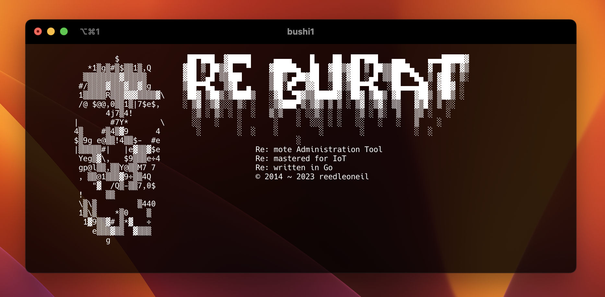
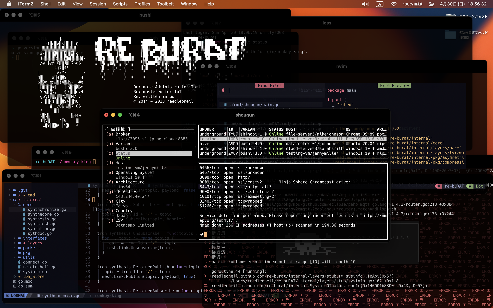

# re: buRAT

re: buRAT is a complete remaster of buRAT, a remote administration tool project that was started in 2014. Initially written in Java and it was eventually reprogrammed for a home automation project.

Like the original buRAT, re: buRAT provides control over remote systems. However, unlike the original buRAT, it was entirely written in Go.

Unfortunately, this project was consuming too much time, and it was decided to focus on other priorities. There will be no time to update this project in the coming years, and it is currently considered on hiatus or dead.

## Source Code

The source code is encrypted twice, the **last 12 digits of the 1st key** the and the **2nd key** to decrypt it was destroyed to put an end to the development. However, the keyword(s) that can be found in a physical book (with no digital copies) can be used to craft the 1st key and it is possible to brute force the 2nd key for a few years. The 2nd key is just a random hash and the 1st key was generated by hashing an unknown keyword(s) that was selected (by a third party) from a rare book with limited copies. The third party is trusted not to provide the keyword(s) to craft the 1st key. 

## Screenshot

